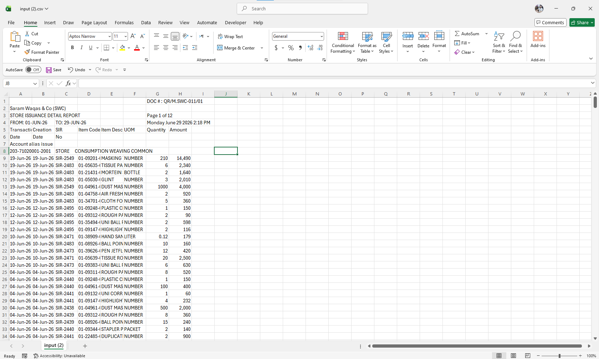
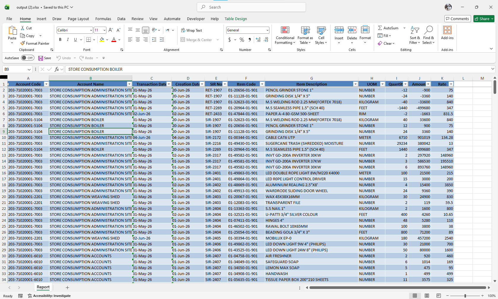
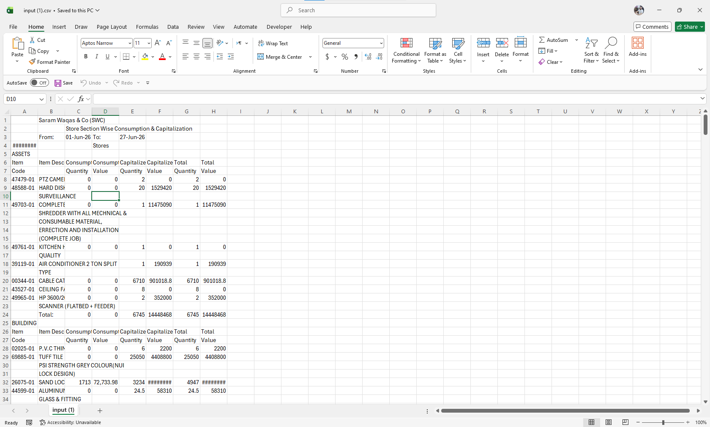
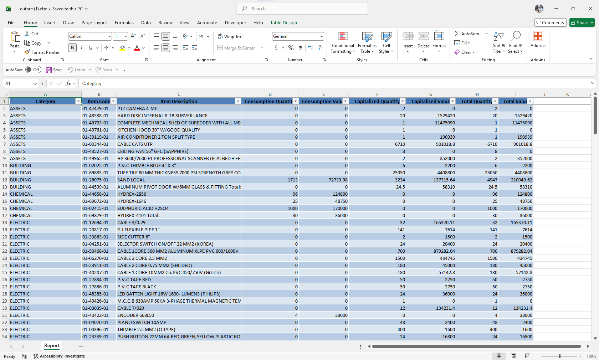

# Python Data Cleaning & CSV/Excel Automation

A collection of Python automation scripts for cleaning messy CSV reports and converting them into clean, structured, and professionally formatted Excel files.

This repository contains two real-world data cleaning projects that demonstrate data extraction, transformation, cleaning, and Excel automation using Python.

---

## Features

* Read raw CSV reports
* Extract required transaction records
* Clean inconsistent text and whitespace
* Clean numeric values
* Calculate item rates automatically
* Sort and organize records
* Export cleaned data to Excel
* Create formatted Excel tables
* Auto-fit column widths
* Freeze header row

---

## Repository Structure

```text
python-data-cleaning-automation/
│
├── Issue_Edit_List_Cleaner/
│   ├── Issue_edit_list_report_cleaner.py
│   ├── Issue_edit_list.csv
│   └── Cleaned_issue_edit_list.xlsx
│
├── Store_Section_Wise_Cleaner/
│   ├── Store_section_wise_report_cleaner.py
│   ├── Store_Section_Wise_Capitalized.csv
│   └── Cleaned_store_Section_Wise_Capitalized.xlsx
│
├── screenshots/
│   ├── issue_before.png
│   ├── issue_after.png
│   ├── store_before.png
│   └── store_after.png
│
└── README.md
```

---

## Requirements

* Python 3.10 or later
* pandas
* openpyxl

Install the required libraries:

```bash
pip install pandas openpyxl
```

---

## How to Run

### Issue Edit List Report Cleaner

Run the script:

```bash
python Issue_Edit_List_Cleaner/Issue_edit_list_report_cleaner.py
```

Input File:

```text
Issue_Edit_List_Cleaner/Issue_edit_list.csv
```

Output File:

```text
Issue_Edit_List_Cleaner/Cleaned_issue_edit_list.xlsx
```

---

### Store Section Wise Report Cleaner

Run the script:

```bash
python Store_Section_Wise_Cleaner/Store_section_wise_report_cleaner.py
```

Input File:

```text
Store_Section_Wise_Cleaner/Store_Section_Wise_Capitalized.csv
```

Output File:

```text
Store_Section_Wise_Cleaner/Cleaned_store_Section_Wise_Capitalized.xlsx
```

---

## Technologies Used

* Python
* Pandas
* OpenPyXL
* Regular Expressions (Regex)

---

## Before & After

### Issue Edit List Report Cleaner

**Before**



**After**



---

### Store Section Wise Report Cleaner

**Before**



**After**



---

## Use Cases

* CSV Data Cleaning
* CSV to Excel Automation
* ERP Report Processing
* Inventory & Store Reports
* Excel Report Generation
* Business Process Automation

---

## Author

**Muhammad Waqas**

If you found this project useful, consider giving it a ⭐ on GitHub.
